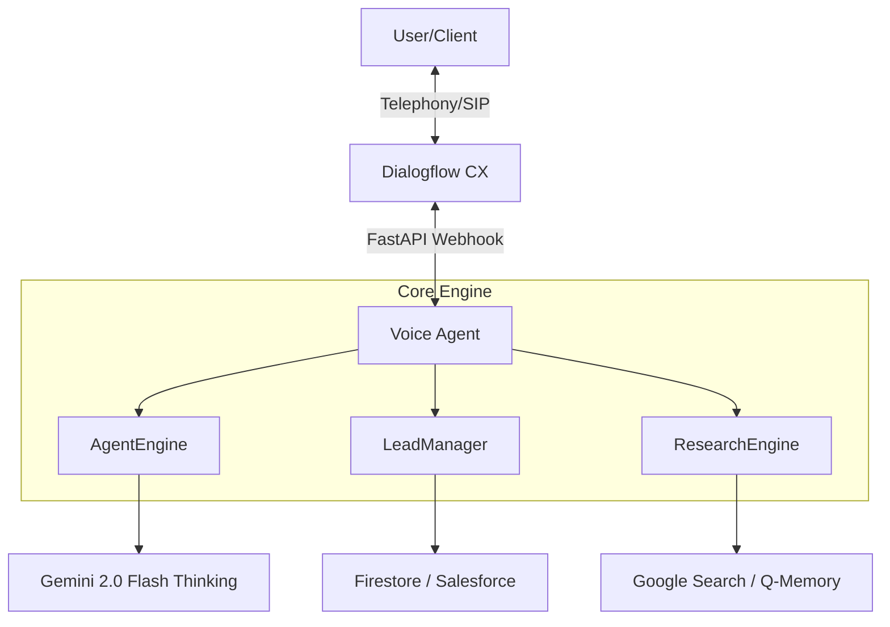

# 🎙️ CORE VOICE AGENT [MISSION: JASON]

> **STATUS:** PROFESSIONAL GRADE | **REVISION:** 4.1.0 | **MAINTAINER:** PHIL HILLS AI LAB

Comprehensive AI Outbound Voice Platform for Professional Mortgage Services. Powered by **A2AC Swarm Protocols** and **Gemini 2.0 Flash Reasoning**.

## 🏗️ SYSTEM ARCHITECTURE



## 🧠 THE "JASON" PERSONA
*   **Role:** High-Fidelity Mortgage Specialist.
*   **Tone:** Warm, efficient, and highly compliant.
*   **Directives:** Qualify leads using VA/Conv/Jumbo logic; book appointments for an NMLS Originator.
*   **Intelligence:** 11-touch cadence orchestration via Salesforce.

## 📁 REPOSITORY STRUCTURE
- `/core`: Operational logic (AgentEngine, LeadManager, Salesforce, etc.)
- `/docs`: Strategic documentation (Guides, Safety, Context)
- `/data`: Sandbox datasets and local configuration
- `/scripts`: Operational tools (Brutalist Monitor, Deployment)
- `/templates`: Web interface assets
- `app.py`: Production-grade FastAPI entry point.

## 📖 DOCUMENTATION
- [About Jason](file:///Users/SoundComputer/Downloads/a2ac.ai/movement-voice-agent/docs/ABOUT.md)
- [Safety & Compliance](file:///Users/SoundComputer/Downloads/a2ac.ai/movement-voice-agent/docs/SAFETY.md)
- [Originator Guide](file:///Users/SoundComputer/Downloads/a2ac.ai/movement-voice-agent/docs/ORIGINATOR_GUIDE.md)
- [Salesforce Admin Guide](file:///Users/SoundComputer/Downloads/a2ac.ai/movement-voice-agent/docs/SF_ADMIN_GUIDE.md)
- [Demo Script](file:///Users/SoundComputer/Downloads/a2ac.ai/movement-voice-agent/docs/DEMO_SCRIPT.md)

## Strategic Design: Q Protocol & A2AC

This platform implementation adheres to the **Q Protocol**, a framework for decentralized agentic orchestration. 

### 🛡️ Hallucination & Compliance Control
- **Reasoner-Talker Loop**: Every response is generated through a dual-pass logic. The 'Reasoner' (Gemini Thinking) plans the response and triggers compliance checks, while the 'Talker' delivers the concise, validated output.
- **Cryptographic Grounding**: Each reasoning trace is hashed into a `thought_signature`. This ensures that the agent's "thinking" is deterministic and auditable.
- **A2AC Orchestration**: Using **Agent-to-Agent Communication**, this agent can poll the A2AC Swarm for real-time market data, ensuring that "Jason" never guesses rates or programs.

## Security Architecture & Compliance [CISO-Ready]

This system is built with a security-first approach, designed to meet rigorous enterprise standards for data sovereignty and auditability.

### 🛡️ Data Sovereignty & Privacy
- **Sanitized Datasets**: All demonstration data ([clients.csv](file:///Users/SoundComputer/Downloads/a2ac.ai/movement-voice-agent/data/clients.csv)) is mocked to prevent PII exposure.
- **Strict Schema Enforcement**: All lead and agent interactions are validated through Pydantic models to prevent injection and data corruption.
- **Deterministic Outbound**: The `ReviewerAgent` performs real-time audit of AI logic to ensure compliance with institutional standards.

### 🔐 Cryptographic Integrity
- **Thought Signatures**: Every reasoning step generated by the AI is signed with a cryptographic hash, ensuring the "Think" trace hasn't been tampered with.
- **Audit-Ready Logs**: Structured logging captures all state transitions, making the system fully auditable.

### 🤖 Local vs. Cloud Hybrid
The system supports local LLM execution (via Ollama/LM Studio) for sensitive processing, ensuring that no competitive intelligence or borrower data leaves the firewall unless explicitly permitted.

## 🚀 OPS & MONITORING
Execute the Brutalist Monitor for real-time mission oversight:
```bash
./scripts/monitor.sh
```

## ⚖️ GOVERNANCE & COMPLIANCE
- **Regulatory Guardrails:** All responses sanitized for mortgage compliance.
- **Audit Chain:** Every decision is cryptographically signed via `thoughtSignature`.
- **Transparency:** Full reasoning traces available for every call turn.

---
*UNAUTHORIZED ACCESS TO THIS VOXELIZED INFRASTRUCTURE IS PROHIBITED.*
