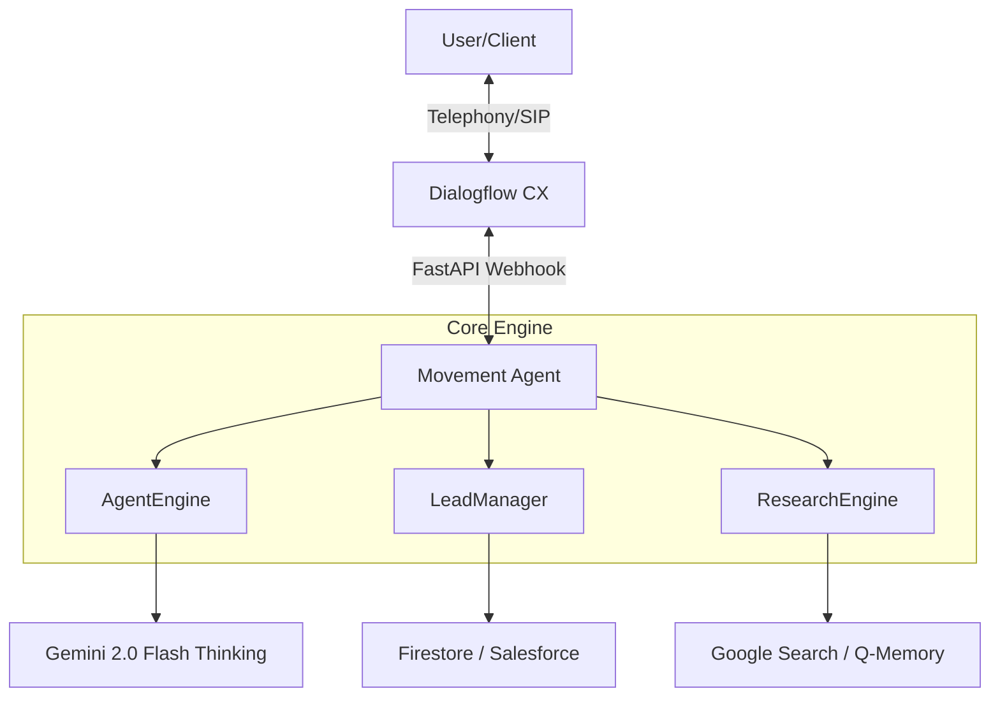

# 🎙️ MOVEMENT VOICE AGENT [MISSION: JASON]

> **STATUS:** PROFESSIONAL GRADE | **REVISION:** 4.1.0 | **MAINTAINER:** PHIL HILLS AI LAB

Comprehensive AI Outbound Voice Platform for Movement Mortgage. Powered by **A2AC Swarm Protocols** and **Gemini 2.0 Flash Reasoning**.

## 🏗️ SYSTEM ARCHITECTURE



## 🧠 THE "JASON" PERSONA
*   **Role:** High-Fidelity Mortgage Specialist.
*   **Tone:** Warm, efficient, and highly compliant.
*   **Directives:** Qualify leads using VA/Conv/Jumbo logic; book appointments for Brad Overlin.
*   **Intelligence:** 11-touch cadence orchestration via Salesforce.

## 📁 REPOSITORY STRUCTURE
- `/core`: Modularized logic (AgentEngine, LeadManager, ResearchEngine).
- `/scripts`: Operational tools (Brutalist Monitor, Deployment).
- `agent.py`: Specialized Jason instance implementing Q Protocol.
- `app.py`: Production-grade FastAPI entry point.
- `salesforce_client.py`: Hardened CRM integration.

## Security Architecture & Compliance [CISO-Ready]

This system is built with a security-first approach, specifically designed to meet the rigorous standards of Michelle Wilson (CISO) and Lyra Waggoner (COO).

### 🛡️ Data Sovereignty & Privacy
- **Sanitized Datasets**: All demonstration data (`clients.csv`) is mocked to prevent PII exposure during audits and sandbox pilots.
- **Strict Schema Enforcement**: All lead and agent interactions are validated through Pydantic models to prevent injection and data corruption.
- **Deterministic Outbound**: The `ReviewerAgent` performs real-time audit of AI logic to ensure compliance with Movement Mortgage standards.

### 🔐 Cryptographic Integrity
- **Thought Signatures**: Every reasoning step generated by the AI is signed with a cryptographic hash, ensuring the "Think" trace hasn't been tampered with.
- **Audit-Ready Logs**: Structured logging captures all state transitions, making the system fully auditable.

### 🤖 Local vs. Cloud Hybrid
The system supports local LLM execution (via Ollama/LM Studio) for sensitive processing, ensuring that no competitive intelligence or borrower data leaves the firewall unless explicitly permitted.

## 🚀 OPS & MONITORING
Execute the Brutalist Monitor for real-time mission oversight:
```bash
./scripts/monitor.sh
```

## ⚖️ GOVERNANCE & COMPLIANCE
- **Regulatory Guardrails:** All responses sanitized for mortgage compliance.
- **Audit Chain:** Every decision is cryptographically signed via `thoughtSignature`.
- **Transparency:** Full reasoning traces available for every call turn.

---
*UNAUTHORIZED ACCESS TO THIS VOXELIZED INFRASTRUCTURE IS PROHIBITED.*
